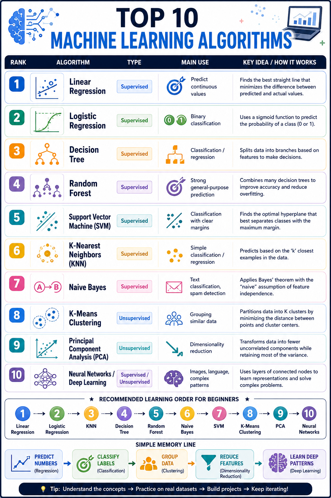

# 十大機器學習演算法互動平台

本專案是一個介紹十大經典機器學習演算法的互動學習平台，提供課程搜尋、演算法參數調整、即時視覺化圖表、課後測驗、學習進度追蹤與 AI 學習助理。

專案同時提供兩種執行方式：

- **完整網站版本：** Next.js 前端搭配 FastAPI 後端
- **Streamlit 版本：** 可直接部署至 Streamlit Community Cloud



## 功能特色

- 瀏覽十大常見機器學習演算法
- 依照演算法名稱、類型與難度搜尋課程
- 閱讀演算法摘要、學習步驟、優點、限制與應用案例
- 調整模型複雜度、正則化強度與訓練資料比例
- 透過互動圖表觀察決策邊界、擬合度、泛化能力與穩定度
- 完成課後測驗並追蹤學習進度
- 使用 AI 學習助理詢問目前課程相關問題
- 使用 FastAPI 自動產生的 API 文件測試後端

## 技術架構

- **前端：** Next.js、React、TypeScript、Lucide React
- **後端：** FastAPI、Pydantic、Uvicorn
- **AI 助理：** OpenAI Responses API
- **獨立部署版本：** Streamlit
- **容器化：** Docker、Docker Compose

## 使用 Docker 啟動完整網站

### 系統需求

- Docker Desktop
- Docker Compose

### 設定環境變數

複製環境變數範例：

```powershell
Copy-Item .env.example .env
```

編輯 `.env` 並設定 OpenAI API Key：

```env
OPENAI_API_KEY=your_api_key_here
OPENAI_MODEL=gpt-5.5
```

若沒有設定 `OPENAI_API_KEY`，其他學習功能仍可使用，但 AI 助理將無法回答問題。

### 啟動服務

```bash
docker compose up --build
```

啟動後可開啟：

- Web application：http://localhost:3000
- FastAPI 文件：http://localhost:8000/docs
- API 健康檢查：http://localhost:8000/api/health

停止服務：

```bash
docker compose down
```

## 本機開發

### 啟動後端

建議使用 Python 3.10 至 3.13。

```powershell
python -m venv .venv
.\.venv\Scripts\Activate.ps1
pip install -r backend/requirements.txt
$env:OPENAI_API_KEY="your_api_key_here"
$env:OPENAI_MODEL="gpt-5.5"
uvicorn backend.app.main:app --reload --host 127.0.0.1 --port 8000
```

### 啟動前端

```bash
cd frontend
npm install
npm run dev
```

前端預設呼叫 `http://localhost:8000`。如需使用其他後端網址，可設定 `NEXT_PUBLIC_API_BASE_URL`。

## Streamlit 版本

Streamlit 版本可獨立執行，不需要另外啟動 Next.js 或 FastAPI。

### 本機啟動

```bash
pip install -r requirements.txt
streamlit run streamlit_app.py
```

啟動後開啟：http://localhost:8501

### 部署至 Streamlit Community Cloud

1. 將此專案推送至 GitHub。
2. 前往 https://share.streamlit.io 並建立新 App。
3. 選擇此 GitHub repository。
4. 將主程式路徑設定為 `streamlit_app.py`。
5. 在 **App settings → Secrets** 加入 OpenAI 設定。
6. 點擊部署。

Streamlit Secrets 範例：

```toml
OPENAI_API_KEY = "your_api_key_here"
OPENAI_MODEL = "gpt-5.5"
```

可參考 [.streamlit/secrets.toml.example](.streamlit/secrets.toml.example)。請勿將真正的 API Key 提交至 GitHub。

## API 端點

| 方法 | 端點 | 說明 |
| --- | --- | --- |
| `GET` | `/api/health` | 檢查 API 狀態 |
| `GET` | `/api/topics` | 取得課程清單，支援 `q`、`family`、`difficulty` 篩選 |
| `GET` | `/api/topics/{slug}` | 依照 slug 取得單一課程 |
| `GET` | `/api/meta` | 取得類型、難度與課程數量 |
| `POST` | `/api/assistant/ask` | 向 AI 學習助理提問 |

AI 助理請求範例：

```json
{
  "question": "請用生活例子解釋線性迴歸",
  "topic_slug": "linear-regression"
}
```

## 專案結構

```text
.
|-- backend/                  # FastAPI 後端與課程資料
|-- frontend/                 # Next.js 互動學習網站
|-- .streamlit/               # Streamlit 主題與 Secrets 範例
|-- streamlit_app.py          # Streamlit Community Cloud 主程式
|-- requirements.txt          # Streamlit 版本依賴
|-- docker-compose.yml        # 完整網站容器設定
|-- .env.example              # 完整網站環境變數範例
|-- ML_Top10_Algorithms_研讀報告_圖文版.html
|-- ML_Top10_Algorithms_研讀報告_圖文版.pdf
`-- 陳煥SIR_Top10機器學習資訊圖表.png
```

## 研讀資料

- [圖文版 HTML 研讀報告](ML_Top10_Algorithms_研讀報告_圖文版.html)
- [圖文版 PDF 研讀報告](ML_Top10_Algorithms_研讀報告_圖文版.pdf)
- [十大機器學習資訊圖表](陳煥SIR_Top10機器學習資訊圖表.png)

## 安全注意事項

- 請勿將 `.env` 或 `.streamlit/secrets.toml` 提交至 GitHub。
- OpenAI API Key 僅應設定於後端環境變數或 Streamlit Secrets。
- `.gitignore` 已排除本機金鑰、快取、建置結果與依賴資料夾。
